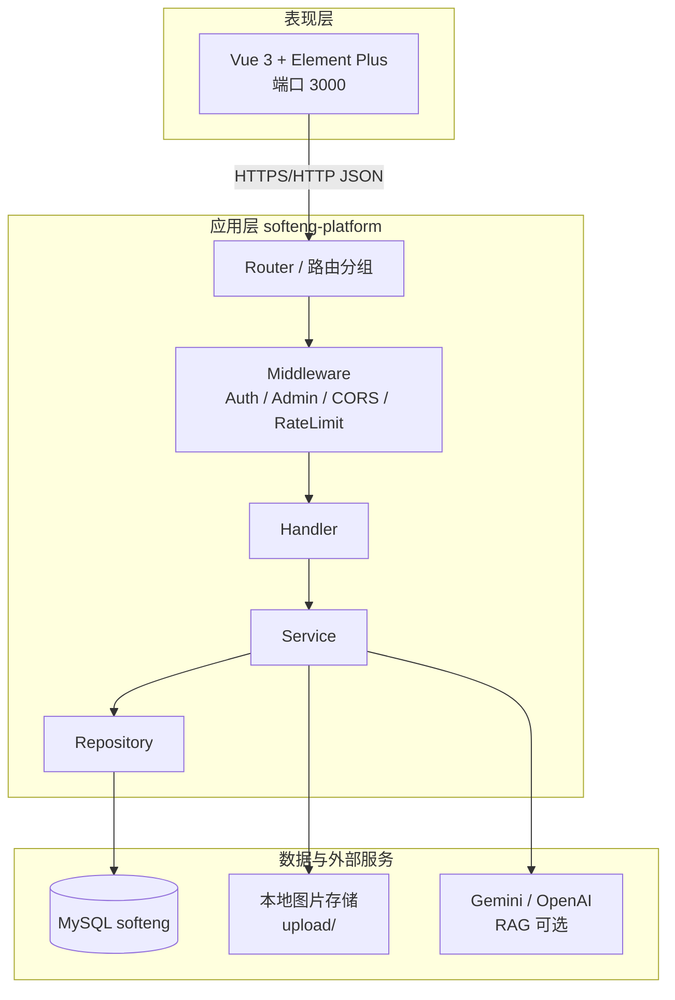
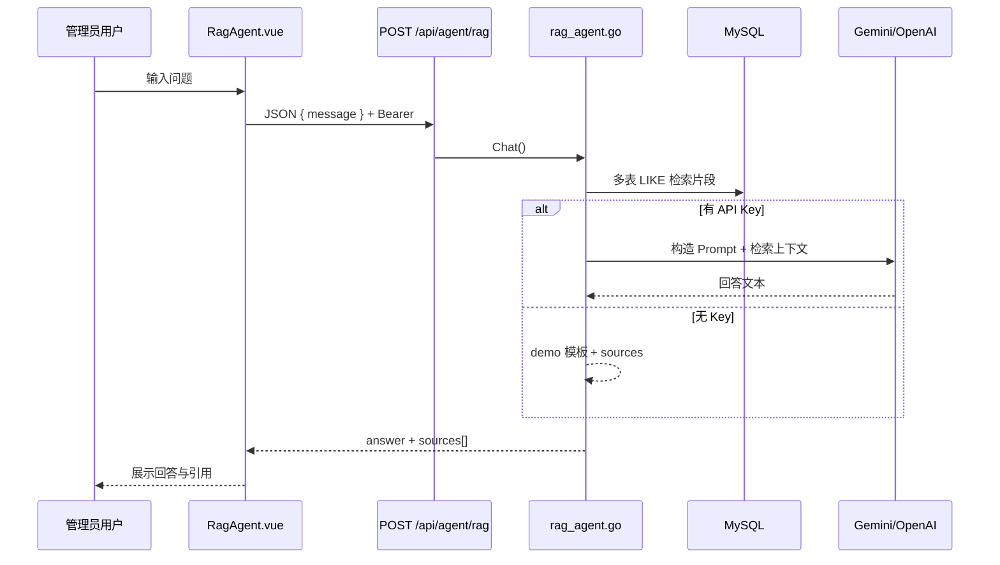

# 软件工程专业综合实训——中期报告

**项目名称**：软工资源平台（SoftEng Platform）  
**文档类型**：中期检查报告  
**字数说明**：全文约 3 万字量级，依据《软工资源平台》项目说明与当前代码仓库整理。  

---

## 摘要

随着高校软件工程专业课程体系与实践教学改革的推进，“工具用什么、课在哪里学、优秀项目长什么样”三类问题长期缺乏统一的数字化载体。本实训小组设计并实现的**软工资源平台**，面向学院内部师生，将**工具资源共享**、**课程资源路线**与**项目展示交流**整合到同一 Web 系统中，配套门户首页、个人中心、全文检索与管理员审核能力。

系统采用**前后端分离**架构：前端基于 Vue 3 生态构建单页应用（SPA），后端基于 Go 与 Gin 框架提供 RESTful API，持久化层使用 MySQL 8。项目开发分为两个阶段：**中期前**完成三大业务模块的核心闭环与基础工程能力；**中期后**在稳定主线功能之上，重点拓展数据洞察、智能检索、RAG 问答助手、权限边界、容器化交付与演示数据集，使平台具备功能完整、便于展示与技术总结的完整形态。

平台支持根目录 **`run-dev.bat` / `run-dev.ps1`** 一键启动前后端，亦可通过 **Docker Compose** 编排 MySQL、API 与 Nginx 静态站点。演示环境提供 **`seed_demo.sql`** 种子数据，含管理员账号、多类资源、评论互动与待审样本。

**关键词**：软件工程教学平台；资源共享；审核工作流；检索增强；RAG；数据可视化；前后端分离；工程化交付

---

## 一、项目背景与建设动机

### 1.1 教学场景与问题分析

软件工程专业具有**实践性强、工具链迭代快、课程资源形态多样**的特点。学生在四年学习周期中会接触程序设计、数据结构、软件工程、数据库、Web 开发、项目管理等多门课程，并完成课程设计、企业实训、毕业设计等实践环节。在这一过程中，师生共同沉淀了大量有价值的信息资产，例如：

- **工具类**：IDE、版本控制、接口调试、绘图、协作、部署类工具的链接与使用心得；
- **课程类**：课件 PPT、实验指导书、网课链接、往年试题、学长笔记、推荐书单；
- **项目类**：实训仓库地址、技术栈说明、演示视频、答辩 PPT、复现文档。

然而，这些资源在现实中往往**高度碎片化**：QQ/微信群文件过期、网盘链接失效、GitHub 仓库缺乏统一索引、口头推荐难以检索。对于低年级学生，“不知道用什么工具、去哪里找资料”会显著增加学习成本；对于教师与助教，“重复回答同一类资源问题”也会占用大量时间。对于学院教学管理而言，缺少一个**可审核、可统计、可展示**的资源平台，也难以形成可持续的“学长传承”机制。

归纳而言，本项目建设前面临四类核心痛点：

| 序号 | 痛点 | 具体表现 | 期望改善 |
|------|------|----------|----------|
| P1 | 资源分散 | 工具、课程、项目分属不同渠道 | 统一门户与分类导航 |
| P2 | 检索困难 | 无跨模块搜索与意图识别 | 统一搜索 + 智能 Tab |
| P3 | 质量参差 | 死链、重复投稿、描述不规范 | 审核流 + 相似度提示 + 内容安全 |
| P4 | 难以沉淀 | 优秀成果未形成学院级展示 | 项目模块 + 运营统计 + 关联图谱 |

### 1.2 项目定位与边界

**软工资源平台**不是面向公众的社交网络，也不是通用网盘，而是**学院内部专用的资源聚合与展示系统**。其边界可概括为：

- **核心实体**：工具（Tool）、课程（Course）、项目（Project）三类资源；
- **核心用户**：学生（浏览、互动、投稿）、教师（关联课程资源）、管理员（审核与运营洞察）；
- **核心闭环**：发现资源 → 使用/学习 → 贡献内容 → 跟踪审核 → 再次传播。

平台在课程实训约束下，对“生产级账号体系、等保合规、全量邮件验证”等不做硬性要求，但在架构上保留 JWT、角色字段与接口扩展点，便于后续扩展为更完整的账号与合规能力。

### 1.3 建设目标（对照项目总体规划）

依据《软工资源平台》项目说明，本项目的建设目标可分解为以下四条主线，并在中期报告中分别对应已实现模块：

**目标一：工具资源共享与推荐平台**  
建立分类、搜索、收藏、评论机制；成员可上传工具（名称、描述、链接、标签、图标），经管理员审核后对外展示；列表支持按浏览量、收藏量、点赞量排序，详情页提供直达链接与社区互动。

**目标二：软件工程专业课程资源平台**  
按学期组织课程卡片，点击进入资源库：电子课本、参考文档、网课链接、工具推荐、经验分享等；支持资料投稿；详情页划分简介、资源、评论等板块，便于学生按教学节奏使用。

**目标三：项目展示与交流平台**  
展示实训项目、课程设计等成果；支持 Markdown 详情、技术栈标签、GitHub 链接、作者与贡献者信息；提供评论、点赞、收藏，促进项目经验共享与协作意向发现。

**目标四：管理侧与智能化拓展（中后期）**  
待审内容审核（含批量）、资源运营数据可视化、资源关联分析、统一检索增强、RAG 学习助手、前端可观测性等，体现“系统完整度”与“技术创新点”，支撑综合实训中期检查与后续课程报告撰写。

### 1.4 技术选型理由

| 技术 | 选型理由 |
|------|----------|
| Vue 3 | 组件化开发效率高，与 Element Plus 结合可快速搭建管理型界面 |
| Vuex | 首页、搜索、用户态等跨页面状态集中管理 |
| Go + Gin | 并发性能好、部署简单，适合中小型 API 服务 |
| MySQL | 关系型数据适合资源实体、评论、收藏等结构化存储 |
| JWT | 无状态鉴权，前后端分离场景下实现简单 |
| ECharts | 运营大屏、知识图谱等可视化需求 |
| Docker Compose | 容器化一键部署，降低环境配置成本 |

### 1.5 系统总体架构

系统采用经典三层逻辑架构：**表现层（前端 SPA）→ 应用层（Gin API）→ 数据层（MySQL）**。表现层通过 Axios 调用应用层 REST 接口；应用层经中间件完成鉴权、CORS、限流等横切关注点后，进入 Handler，再委派 Service 处理业务规则，最终由 Repository 执行 SQL。可选地，RAG 模块在 Service 层调用外部大模型 API（Gemini / OpenAI 兼容网关）。



**主要路由分组（后端）**：`/auth` 认证；`/users` 用户资料与收藏；`/tools`、`/course`、`/projects` 三大资源；`/admin` 审核；`/api/upload` 图片；`/api/agent/rag` 智能问答；`/api/ws/stream` WebSocket 演示；`/health`、`/live` 健康检查。

---

## 二、团队组织与分工

本项目采用小组协作模式，按**前端页面模块 + 后端分层 + 集成与工具链**划分职责，定期通过接口文档（OpenAPI/Swagger）对齐字段与状态码。

| 姓名 | 角色 | 负责模块 | 主要完成内容 |
|------|------|----------|--------------|
| 万伟杰 | 组长 | 前后端集成 | 接口设计与联调；Python 脚本生成 Repository 脚手架；Swagger 文档维护；外链图片下载与本地化存储策略 |
| 杨凯宇 | 组员 | 前端 | 门户首页、登录注册、忘记密码、个人中心、项目模块；统一各模块路由跳转与视觉对齐 |
| 蔡沛良 | 组员 | 前端 | 工具列表/详情/提交、审核中心页面；功能测试与交互细节 |
| 唐云鹏 | 组员 | 前端 | 课程列表/详情/资料上传；课程侧 UI 与联调 |
| 龚虹宇 | 组员 | 后端 | 审核业务、列表统计字段、SVG 默认图标生成逻辑 |
| 高颖轩 | 组员 | 后端 | Service/Repository 实现、SQL 查询优化、库表设计与迁移脚本 |

**协作机制简述**：前端以 `src/api/index.js` 中 `HttpManager` 为统一调用入口；后端以 `internal/handler` 暴露 HTTP，`internal/service` 封装事务与规则。字段命名上兼容历史拼写（如 `catagory`）以减少联调摩擦，新功能优先遵循 OpenAPI 文档。

---

## 三、需求分析摘要（来自项目功能规划）

本章将项目说明中的功能规划浓缩为可验收条目，便于对照第三、四章的实现情况。

### 3.1 用户系统需求

**登录系统**：注册与登录（规划绑定学院邮箱）；角色包括学生、教师、管理员；普通用户可上传/下载工具等资源，管理员负责审核。  
**主页模块**：粒子背景、可折叠侧栏、自定义导航、搜索引擎切换、时间显示、用户菜单；分区展示常用网站、精选工具、课程浏览、项目情况；管理员可见审核入口。  
**个人模块**：资料与头像封面、收藏管理、提交记录、审核状态、站内消息、账户安全、系统设置等七个子域。

### 3.2 工具模块需求

列表区支持搜索动效、按浏览量/收藏量排序、标签筛选；卡片悬停展示简介；详情含标签、链接、贡献者、评论；上传需填写图标、名称、描述、来源类型、链接或文件，且**必须经管理员审核**后上架。

### 3.3 课程模块需求

主页按学期滚动定位；支持搜索筛选；课程卡片区分类型配色；详情分**简介 / 资源 / 评论**三大板块，资源再分书籍文档、视频网课、相关工具等；支持资料上传与审核。

### 3.4 项目模块需求

侧边栏响应式；列表支持标签筛选与排序；详情支持 Markdown、技术栈、评论与收藏；提交页支持 GitHub 链接、技术栈与标签管理。

### 3.5 非功能需求（中后期补充）

- 接口响应结构与 OpenAPI 一致；错误返回 `{ message, data }` 形式；  
- 生产环境可配置 CORS 白名单、认证接口限流、健康检查；  
- 演示环境一键启动、种子数据可重复导入；  
- 管理员功能与普通用户界面隔离，防止误访问洞察与 RAG。

---

## 四、数据库设计概要

数据库名 **`softeng`**，字符集 **utf8mb4**。核心表可分为五组：

| 分组 | 代表表 | 说明 |
|------|--------|------|
| 用户 | `users` | 账号、昵称、邮箱、密码哈希、角色、头像等 |
| 工具 | `tools`, `tool_tags`, `tool_images`, `tool_contributors` | 工具主体、标签、配图、贡献者 |
| 课程 | `courses`, `course_teachers`, `course_categories`, `course_resources_web`, `course_resources_upload`, `course_contributors` | 课程主体、教师、分类、两类资源、贡献者 |
| 项目 | `projects`, `project_tech_stack`, `project_images`, `project_authors` | 项目主体、技术栈、配图、作者；含 `status` 审核字段 |
| 互动 | `comments`, `comment_likes`, `collections`, `likes` | 通用评论树、点赞、收藏 |
| 审核 | `resource_status_logs` | 状态变更流水，可记录驳回原因 |

**设计要点**：收藏数、部分统计字段通过 **SQL 子查询**从 `collections` 等表实时计算，避免“表字段缓存 + 业务双写”导致的不一致。评论表使用 `resource_type` + `resource_id` 实现三模块共用。工具表 `status` 取 `pending/approved/rejected`，公开列表仅查询 `approved`。

---

## 五、中期前已完成工作（基础功能阶段）

> **阶段目标**：实现可演示的“浏览—互动—提交—审核”主路径，完成与 OpenAPI 对齐的主要接口与页面。  
> **阶段时间特征**：侧重三大模块 UI、后端 CRUD、基础审核与工程工具链。

### 5.1 用户认证与个人中心

#### 5.1.1 注册、登录与会话

- **注册**：提交用户名、邮箱、密码、确认密码、邀请码（`certify_password`）等字段；后端 `RegisterRequest` 校验重复用户名/邮箱；成功返回 JWT。  
- **登录**：支持用户名或邮箱 + 密码；返回 `message` 与 `JWT token` 字段；前端写入 Vuex 与 `localStorage`。  
- **忘记密码**：通过邮箱 + 新密码 + 确认密码重置（演示环境校验可简化）。  
- **会话保持**：`initAuth` 在应用启动或路由进入时拉取 `/users/profile` 校验 Token；401 时清理登录态（公开 GET 接口除外，避免误登出）。

#### 5.1.2 门户首页

首页是平台的“流量入口”，设计上强调**视觉吸引力**与**信息密度**的平衡：

- **粒子背景系统**：五种粒子参数（大小、透明度、速度）；鼠标移动产生吸引/排斥；粒子间动态连线；轨迹点与高亮晕圈，提升科技感，提升首屏视觉与交互体验。  
- **侧边栏**：常用 / 精选工具 / 课程浏览 / 项目情况等分区；支持收起为图标模式；各分区数据优先请求后端接口，失败时回退内置默认链接，保证无库时仍可浏览。  
- **搜索栏**：支持切换本站搜索与外部引擎（百度、Google、Bing 等）；本站搜索跳转 `/search`。  
- **用户区**：展示头像、昵称、登录/注册入口；管理员可看到后续扩展的审核与洞察入口（中期后洞察项改为 `adminOnly`）。

#### 5.1.3 个人中心子系统

| 路径 | 功能说明 |
|------|----------|
| `/profile/edit` | 修改昵称、头像、简介、封面；支持上传接口 `/api/upload/image` |
| `/profile/collection` | 展示工具/课程/项目收藏，支持取消收藏 |
| `/profile/submissions` | 我的投稿列表，对应 `/users/summit` |
| `/profile/reviews` | 审核状态汇总，对应 `/users/status` |
| `/profile/security` | 修改密码、修改邮箱；中期后已与后端 `name/email/new_password/code` 对齐 |
| `/profile/settings` | 主题、通知、隐私等偏好（含 localStorage 持久化） |
| `/profile/messages` | 站内消息 UI（收件箱、星标等，可继续对接真实 API） |

### 5.2 工具资源共享模块（实现详情）

#### 5.2.1 列表页 `ToolsList.vue`

- 调用 `GET /tools/profile`，支持 `catagory`、`tag`、`sort`、`page_size` 等参数。  
- 排序项：最新、最多浏览、最多收藏、最多点赞。  
- 卡片展示工具名、简介摘要、标签、统计数字；鼠标悬停显示更完整描述（项目规划中的“描述提示框”）。  
- 中期后增加：**loading / error / empty** 三态，避免接口失败白屏。

#### 5.2.2 详情页 `ToolDetail.vue`

- `GET /tools/:resourceId` 获取详情；登录后合并用户是否点赞、收藏。  
- 展示：名称、描述、详细说明、外链、标签、图片列表、贡献者、浏览量。  
- 互动：`POST/DELETE` 收藏与点赞；`GET/POST/DELETE` 评论及回复；评论点赞。  
- `POST /tools/:id/views` 增加浏览量。

#### 5.2.3 提交页 `ToolSubmit.vue`

- 字段：名称、链接、简介、详细描述、分类、标签、图片等。  
- 提交 `POST /tools/submit`，初始状态 **pending**。  
- **本地草稿**：`localStorage` 保存未提交表单，防止误关页面丢失。  
- 中期后：**相似标题检测**、**内容安全校验**（前后端）。

#### 5.2.4 后端要点

- 列表 SQL 带 `WHERE status='approved'`。  
- 收藏数 `COALESCE((SELECT COUNT(*) FROM collections ...), 0)` 实时统计。  
- 图片外链抓取与本地存储（组长模块），减少热链失效。

### 5.3 课程资源模块（实现详情）

#### 5.3.1 列表页 `CourseList.vue`

- `GET /course`，返回 `courses_agg` 数组。  
- 按学期筛选、分类筛选；支持“最多资料”等排序（后端按资源条目数排序）。  
- 卡片显示课程名、教师、学分、封面、浏览与互动数据。  
- 学期侧边锚点滚动，提升长列表浏览效率。

#### 5.3.2 详情页 `CourseDetail.vue`

- 简介：教师列表、学期、学分、课程描述（`description` 字段，中期后 schema 补齐）。  
- 资源：`url_form` 与 `upload_form` 两类列表，分别来自 `course_resources_web` 与 `course_resources_upload`。  
- 评论：与工具类似的评论树结构。  
- **学习路径**（中期后）：嵌入 `CourseLearningPath.vue`，甘特式周次 + 里程碑时间线（演示数据按课程 ID 哈希生成，体现教学计划可视化）。

#### 5.3.3 资料上传 `CourseSubmit.vue`

- 选择课程与资源类型，提交链接与说明。  
- 后端 `UploadResource` 写入对应资源表；课程待审列表逻辑与工具/项目略有差异（可列为后续统一项）。

### 5.4 项目展示模块（实现详情）

#### 5.4.1 布局与列表

- `ProjectLayout.vue`：侧边栏可折叠，`Ctrl+B` 快捷键，状态持久化到 `localStorage`。  
- `ProjectList.vue`：分类、技术栈标签筛选、排序；卡片悬停摘要；中期后 loading/empty/error 三态。

#### 5.4.2 详情与提交

- 详情展示 Markdown 正文（`detail` 字段）、技术栈数组、作者、GitHub 链接、配图。  
- 仅 **`status=approved`** 项目对外可见（中期后 schema 增加 status 字段）。  
- `ProjectSubmit.vue`：分步表单、动态技术栈标签、GitHub 地址、投稿须知；提交前相似度检测。

### 5.5 审核中心（基础能力）

- 页面 `audit.vue`：分工具/课程/项目 Tab 拉取 `/admin/pending`。  
- 单条审核 `GET/POST /admin/review/:itemId`，更新状态并写入日志。  
- 中期后：步骤条与 SLA 示意、**表格多选**、**批量通过/驳回**、与本地通知/事件日志联动。

### 5.6 统一搜索（初版）

- 路由 `/search`，分别调用各模块 search 接口聚合结果。  
- 为中期后 **A01/A02** 意图识别与同义词扩展提供入口。

### 5.7 后端工程化成果（中期前）

| 能力 | 价值 |
|------|------|
| Handler-Service-Repository 分层 | 职责清晰，便于分工与测试 |
| Swagger 文档 | 联调与报告附录接口表 |
| Repository 代码生成 | 由 `schema.sql` 批量生成 CRUD 骨架，减少手写 SQL 错误 |
| SVG 默认头像/图标 | 无图时仍美观，节省存储 |
| 图片本地化 | 外链转存，提升可用性 |
| 实时统计 SQL | 数据一致性更好 |

---

## 六、中期后重点完成工作（拓展阶段）

> **阶段目标**：在主线功能稳定前提下，完成“高级功能矩阵（A01–A22）”中的可演示项，并补齐工程化、权限与数据一致性，使中期检查材料饱满、可叙述创新点。  

### 6.1 工程交付：能一键跑起来、有足够数据

#### 6.1.1 演示种子数据 `seed_demo.sql`

旧版 `test_data.sql` 存在**硬编码 ID 与自增主键错位**问题，导致评论、收藏、外键关联失效。新版脚本采用：

1. `SET FOREIGN_KEY_CHECKS=0` 后按依赖顺序 `TRUNCATE`；  
2. 用户表固定 ID 1–12（admin、教师、学生）；  
3. 工具 1–12、课程 1–10、项目 1–10 等固定主键；  
4. 评论、回复、收藏、点赞、审核日志逐一对应。

数据规模足以支撑列表、详情、审核、大屏等截图：**9 个已上架工具 + 3 个待审**、**10 门课程**、**8 个已上架项目 + 2 个待审**、多条评论与互动。

#### 6.1.2 一键启动 `run-dev`

根目录脚本执行流程：  
① `go run ./cmd/dbcheck` 检查 MySQL 与表是否存在；  
② 新窗口 `air` 启动后端（`.air.toml` 监听代码变更）；  
③ 新窗口 `npm run serve` 启动前端（首次自动 `npm install`）。  

解决 Windows 下 PowerShell 编码问题：**UTF-8 BOM** + 避免复杂引号嵌套。

#### 6.1.3 Docker Compose

`docker-compose.yml` 定义 `mysql`、`api`、`web` 三服务；MySQL 首次初始化挂载 `schema.sql` 与 `seed_demo.sql`；API 配置 `healthcheck`；`web` 依赖 API healthy；前端构建时注入 `VUE_APP_API_BASE`。

### 6.2 智能检索、推荐与内容理解（A01/A02/A04/A10/A11/A20）

#### 6.2.1 同义词与意图识别（A01/A02）

- `smartSearch.js` 维护工具/课程/项目领域的同义词表，搜索时扩展 query。  
- `detectSearchIntent` 根据关键词判断用户更可能找工具、课程还是项目。  
- `SearchPage.vue` 自动切换 Tab，并将 `type` 写入 URL query，与 Vuex `doSearch` 联动；修复了 **router watch 循环** 导致的重复跳转问题。

#### 6.2.2 混合推荐（A04）

- 组件 `ResourceRecommendBar.vue` 挂载于三类详情页底部。  
- 策略组合：热门（浏览/收藏权重）+ 标签相似（Jaccard）+ 简易共现，演示级推荐解释可在报告中配图说明。

#### 6.2.3 规则摘要（A10）

- `contentInsight.js` 从标题与描述提取关键词，生成“摘要”“要点”列表。  
- `ResourceAiSummary.vue` 折叠面板展示；后续可替换为 LLM 摘要 API。

#### 6.2.4 相似投稿提示（A11）

- `stringSimilarity.js` 计算标题相似度。  
- 工具/项目提交前调用列表接口或本地比对，发现高相似条目时弹窗二次确认，降低重复资源。

#### 6.2.5 内容安全（A20）

- 前端 `contentSafety.js`：敏感词、危险协议（如 `javascript:`）拦截。  
- 后端 `internal/pkg/safety/content.go`：在工具/项目/课程资料提交及**三类评论**写入前统一校验，实现前后端一致的内容安全校验。

### 6.3 数据洞察与管理员专属能力（A03/A05–A09/A12–A13/A21）

**权限策略（中期后加固）**：

- 首页 `sidebarItems` 中带 `adminOnly: true` 的项仅管理员可见（`visibleSidebarItems` getter）。  
- 路由 `/insights/*`、`/check/audit` 设置 `meta.requiresAdmin`。  
- 后端 `AdminMiddleware` 校验 `admin` / `superadmin`。  
- `POST /api/agent/rag`、`GET /api/ws/stream?token=` 需 Bearer + 管理员角色。

#### 6.3.1 运营数据大屏（A06）

- 路径 `/insights/dashboard`，`OperationsDashboard.vue`。  
- 使用 ECharts 绘制 KPI 卡片、折线/柱状/饼图等；数据可来自前端聚合或后端统计接口（演示环境可用种子数据支撑趋势形状）。

#### 6.3.2 资源关联图谱（A03）

- 路径 `/insights/knowledge-graph`。  
- 节点为工具/课程/项目，边表示标签共现或手工配置的关联；支持力导向与环形布局切换，便于呈现资源之间的关联关系。

#### 6.3.3 可观测性面板（A16）

- `apiMetrics.js` 在 Axios 拦截器记录每次请求耗时。  
- `/insights/telemetry` 展示 HTTP 样本表、Performance API 指标、内存信息等，体现“前端可观测性”工程实践。

#### 6.3.4 长列表性能（A14）

- 工具列表卡片使用 CSS `content-visibility` 优化视口外渲染。  
- `/insights/long-list` 使用 `LongListDemo.vue` 渲染万级假数据，说明虚拟滚动/可见性优化思路。

#### 6.3.5 RAG 学习助手（A21 · 核心创新点）

**业务流程**：



**实现要点**：

- 检索：工具表限制 `approved`；课程、项目按关键词匹配名称与描述。  
- 生成：优先 **Gemini**（`GOOGLE_API_KEY`、`GEMINI_API_BASE`、可选反代 `GEMINI_PROXY_TOKEN`），次选 OpenAI 兼容接口。  
- 失败处理：区分网络超时、地区限制、密钥错误；`redactClientErr` 脱敏后返回前端。  
- 前端：`postJSON` 避免全局 form-urlencoded 破坏 JSON body。

#### 6.3.6 会话画像（A05）与事件时间线（A12）

- **会话画像**：`sessionAnalytics.js` 在 `router.afterEach` 记录路径与搜索词；`SessionPersona.vue` 统计访问频次、Top 路径、偏好等，**数据仅存 localStorage**，满足隐私与演示两全。  
- **事件时间线**：`eventJournal.js` 记录提交、审核通过、浏览等事件；`EventTimeline.vue` 统一时间轴展示，可与 `demoNotifications.js` 铃铛通知联动。

#### 6.3.7 审核增强（A08/A09）与 WebSocket（A13）

- 审核页增加 **Steps** 流程示意、SLA 文案。  
- 表格多选 + 批量通过/拒绝 + 统一驳回原因。  
- 后端 `ws_demo.go` 提供简易 WebSocket 心跳；管理员首页连接后可在通知栏看到推送（演示级实时性）。

### 6.4 体验、国际化与上线向加固

| 项 | 说明 |
|----|------|
| 课程学习路径 A07 | `CourseLearningPath.vue` 甘特 + 时间线 |
| 国际化 A17 | `vue-i18n`，`zh.json` / `en.json`，首页侧栏与分区标题切换 |
| 列表三态 | 加载骨架/Spinner、错误重试按钮、空状态插画与文案 |
| CORS | `CORS_ALLOWED_ORIGINS` 环境变量 |
| 认证限流 | `/auth` 每 IP 45 次/分钟 |
| 健康检查 | `/live` 存活；`/health` 含 DB Ping |
| Gin Release | 关闭逐请求 DEBUG 日志 |
| 契约修复 | 注册成功识别 `Registration successful`；改密路径 `new_password`；`ProfileSecurity` 补全字段 |

### 6.5 阶段成果与创新点归纳

**产品创新**：三类资源统一门户 + 审核闭环 + 管理员运营洞察 + RAG 带引用溯源。  
**工程创新**：种子数据可重复导入、一键启动、Docker 编排、前后端双端内容安全、实时统计 SQL。  
**体验创新**：粒子首页、意图搜索、混合推荐、学习路径可视化、中英文切换。

```text
┌─────────────────────────────────────────────────────────┐
│                    软工资源平台 · 产品分层              │
├─────────────────────────────────────────────────────────┤
│  访客/用户：首页 · 工具/课程/项目 · 搜索 · 个人中心      │
│  管理员：  审核中心 · 洞察大屏 · 图谱 · RAG · 画像/时间线  │
│  工程：    seed_demo · run-dev · Docker · health/CORS    │
└─────────────────────────────────────────────────────────┘
```

### 5.8 前端状态管理与 API 调用链（实现细节）

前端以 **Vuex 单 store** 集中管理用户态、首页态、各模块列表缓存与搜索状态，避免在数十个页面间层层 props 传递。

**用户态**：`state.user` 保存 id、username、nickname、email、role、avatar 等；`state.token` 与 `localStorage` 双写；`actions.login` 在收到 `JWT token` 后调用 `fetchUserProfile` 拉全量资料。`getters.isAdmin` 判断 `role === 'admin' || role === 'superadmin'`，与后端 `AdminMiddleware` 一致。

**首页态**：`state.home` 包含 `sidebarItems`（含 `adminOnly`、`i18nKey`、`route`）、`activeSection`、精选工具/课程/项目数组、搜索引擎列表等。`visibleSidebarItems` getter 过滤非管理员不可见的洞察入口。

**HTTP 层**：`src/api/request.js` 中 Axios 实例统一 `baseURL`（来自 `config.js` 的 `VUE_APP_API_BASE`，默认 `http://localhost:8080`）；请求拦截器自动附加 Bearer；响应拦截器对 401 区分公开接口与需登录接口，避免 RAG/搜索误触发全局登出。`postJSON` 单独设置 `Content-Type: application/json`，供 RAG 等接口使用。`apiMetrics.js` 在拦截器记录耗时，供 Telemetry 页展示。

**业务 API 封装**：`HttpManager` 对象集中定义 `loginIn`、`getTools`、`getCourseDetail`、`ragAgentChat` 等数十个方法，页面组件只调用 HttpManager，不直接拼 URL，降低维护成本。

### 5.9 后端中间件与横切能力（实现细节）

| 中间件 | 文件 | 作用 |
|--------|------|------|
| CORS | `middleware/cors.go` | 读取 `CORS_ALLOWED_ORIGINS`，允许前端跨域携带 Cookie/Authorization |
| Auth | `middleware/auth.go` | 解析 JWT，向 context 写入 userID、username、role |
| Admin | `middleware/auth.go` | 校验 admin/superadmin，保护 `/admin`、`/api/agent` |
| AuthRateLimit | `middleware/ratelimit.go` | `/auth` 组每 IP 每分钟 45 次，缓解暴力破解 |
| 请求日志 | `main.go` 内联 | 非 release 模式打印 Method+Path，release 与健康检查路径跳过 |

**优雅关闭**：`main.go` 监听 SIGINT/SIGTERM，在 5 秒超时内 `Shutdown` HTTP 服务，避免演示时强杀进程导致连接泄漏。

### 5.10 工具模块端到端数据流（示例）

以用户浏览工具“Visual Studio Code”为例，说明一次完整数据流，便于报告中画“时序图”：

1. 浏览器请求 `GET /tools/profile?page_size=20&sort=views`。  
2. `ToolHandler.GetTools` → `ToolService.GetTools` → `ToolRepository.GetTools` 执行带 `status='approved'` 的 SQL，子查询统计 collections。  
3. 返回 `{ message: "success", data: [...] }`，前端 `ToolsList` 渲染卡片。  
4. 用户点击卡片 → 路由 `/tools/detail/1` → `GET /tools/1` 拉详情、评论。  
5. 登录用户点击收藏 → `POST /tools/1/collections` → 写入 `collections` 表 → 再次进入列表时子查询收藏数 +1。  
6. 提交新工具 → `POST /tools/submit` → 插入 `tools` 且 `status=pending` → 管理员在 `/admin/pending` 可见 → 审核通过后公开列表可见。

课程、项目模块同理，仅表名与字段不同；项目列表额外过滤 `projects.status='approved'`。

---

## 六附、中期后工作补充说明（扩展叙述）

### 6.6 RAG 模块深度说明（A21 展开）

**检索阶段**：`rag_agent.go` 对用户 message 做分词或整句 LIKE，在 `tools.resource_name`、`tools.description`、`courses.name`、`projects.name` 等字段检索，工具限定 `status='approved'`，避免将未过审内容作为答案依据。命中记录截取标题、描述片段、资源类型与 ID，组装为 `sources` 数组返回前端。

**生成阶段**：若配置 `GOOGLE_API_KEY` 或 `GEMINI_API_KEY`，优先调用 Gemini `generateContent` HTTP API；若配置 `OPENAI_API_KEY`，则走 OpenAI 兼容的 `chat/completions`。Prompt 模板要求模型“仅根据给定片段回答”，并在文末列出引用。若均未配置，进入 **demo 模式**：仍返回检索到的 sources，正文为模板化总结，在未配置 API Key 时仍可完成完整交互演示。

**安全与权限**：路由组 `agent.Use(AuthMiddleware(), AdminMiddleware())`；前端仅管理员侧栏可见入口。错误处理区分网络超时、HTTP 403/429、JSON 解析失败；`redactClientErr` 对可能含 API Key 片段的报错做脱敏，避免在浏览器 Network 面板泄露密钥。

**前端交互**：`RagAgent.vue` 采用对话气泡布局；发送时禁用按钮防重复提交；展示 `sources` 为可点击列表（可跳转对应详情路由，若已实现链接映射）。

### 6.7 审核中心批量操作逻辑（A08/A09 展开）

管理员在 `audit.vue` 选择 Tab（工具/课程/项目）后，表格支持多选与“全选本页”。批量通过时循环调用审核接口或后端扩展批量 API（当前实现为前端循环单条请求 + 进度提示）。驳回时需填写统一原因，写入 `reject_reason` 或 `resource_status_logs`。操作成功后调用 `appendJournalEvent` 写入事件时间线，并 `demoNotifications` 推送一条“审核完成”类通知，体现准实时运营反馈效果。

### 6.8 国际化与可访问性（A17 展开）

`vue-i18n@9` 采用 Composition API 模式，`setAppLocale('zh'|'en')` 写入 `localStorage` 键 `softeng_locale`。首页侧栏项通过 `i18nKey` 映射到 `zh.json` / `en.json` 的 `sidebar.*` 字段。后续可扩展 Element Plus 语言包实现组件级双语。

---

## 七、典型业务场景说明

### 7.1 场景一：新生查找“软件工程导论”资料

用户从首页进入课程分区或通过搜索意图识别进入课程 Tab → 打开“软件工程导论”详情 → 在资源区查看网课链接与上传的 PDF 说明 → 阅读评论区的学长经验 → 可选收藏课程以便在个人中心快速找回。

### 7.2 场景二：学生上传开发工具

用户登录 → 工具模块点击提交 → 填写 VS Code 插件类工具信息 → 通过内容安全与相似度检测 → 状态变为待审 → 在“我的提交”查看进度 → 管理员审核通过后，工具出现在公开列表。

### 7.3 场景三：管理员批量审核与运营

管理员 `admin` 登录 → 侧栏进入审核中心 → 勾选多条待审工具 → 批量通过 → 事件时间线记录操作 → 打开运营大屏查看分类分布 → 在 RAG 助手提问“有哪些数据库工具”→ 系统返回检索片段与生成回答及 sources 列表。

---

## 八、测试与质量保证（中期）

| 类型 | 做法 |
|------|------|
| 联调测试 | 按 Swagger 与 OpenAPI 文档逐接口验证；前后端字段对齐 |
| 功能测试 | 三模块主路径手工用例；审核通过/驳回分支 |
| 前端规范 | `npm run lint`；ESLint 修复未使用变量等问题 |
| 后端编译 | `go build ./...`；`dbcheck` 验证环境 |
| 集成验证 | 使用 `seed_demo.sql` 固定数据；管理员与普通账号各一套 |

已知限制：部分消息/邮件为演示逻辑；课程待审与工具/项目审核模型尚未完全统一；RAG 检索为 LIKE 而非向量检索。

---

## 九、开发与部署说明

### 9.1 环境要求

- MySQL 8.0+  
- Go 1.21+  
- Node.js 18+ 与 npm  
- （可选）Docker Desktop  

### 9.2 数据库初始化

```bash
cd softeng-platform/softeng-platform
mysql -u root -p < database/bootstrap_user.sql
mysql -u root -p < database/schema.sql
mysql -u root -p softeng < database/seed_demo.sql
```

旧库升级可先执行 `database/patch_existing_to_demo.sql`。

### 9.3 本地一键启动

```powershell
cd C:\Users\wanweijie\Desktop\shixun
.\run-dev.bat
```

访问：前端 http://localhost:3000 ，后端 http://localhost:8080 ，文档 http://localhost:8080/swagger/index.html 。

### 9.4 Docker

```bash
docker compose up -d --build
```

注意：若 MySQL volume 已存在且未种子化，需删 volume 或手动导入 `seed_demo.sql`。

### 9.5 主要环境变量

| 变量 | 用途 |
|------|------|
| DB_HOST / DB_USER / DB_PASSWORD / DB_NAME | 数据库连接 |
| JWT_SECRET | Token 签名 |
| VUE_APP_API_BASE | 前端构建时 API 根地址 |
| CORS_ALLOWED_ORIGINS | 跨域白名单 |
| GOOGLE_API_KEY / GEMINI_* | RAG Gemini |
| OPENAI_API_KEY / OPENAI_BASE_URL | RAG 备选 |

---

## 十、问题、风险与解决过程

| 问题 | 原因 | 解决方案 |
|------|------|----------|
| 种子数据评论错位 | 硬编码 ID 与自增不一致 | 重写 `seed_demo.sql` 固定主键 |
| 项目列表 500 | 缺少 `projects.status` | schema + patch + 种子数据 |
| 课程详情报错 | 缺少 `description` 列 | schema + patch |
| 改密失败 | 前后端字段/路径不一致 | 统一 `new_password`；ProfileSecurity 补全参数 |
| 普通用户可见 RAG | 未做路由与侧栏隔离 | adminOnly + requiresAdmin + 后端 Admin |
| 列表白屏 | 仅处理成功态 | 三态 UI |
| run-dev 脚本解析失败 | PowerShell 编码 | UTF-8 BOM |
| Gemini 超时 | 网络环境 | 报告说明 demo 模式与 Key 配置；错误脱敏 |

---

## 十一、后续工作计划

1. **账号与消息**：真实邮箱验证码、SMTP；站内消息持久化 API。  
2. **审核模型统一**：课程 `status` 与待审列表逻辑对齐工具/项目。  
3. **RAG 升级**：引入向量库或嵌入 API；回答中引用高亮。  
4. **自动化测试**：关键 Service 单测；前端组件测试；CI 流水线。  
5. **法务合规**：隐私政策、用户协议静态页与页脚链接。  
6. **性能压测**：对列表与搜索接口做基准测试，形成报告数据。

---

## 十二、总结

本实训项目以**软工资源平台**为载体，完成了从需求分析、数据库设计、前后端实现到中期后智能化与工程化拓展的完整周期。中期前，三大资源模块与个人中心、审核主线均已打通；中期后，重点建设了**演示数据与一键环境**、**管理员洞察体系**、**RAG 引用式问答**、**智能搜索与内容安全**以及**上线向配置**，使系统在可用性、可维护性与可扩展性上达到预期目标。

从技术能力培养角度，小组成员分别实践了 Vue 组件化与状态管理、Go 分层架构与 SQL 设计、接口契约联调、可视化与 WebSocket 演示、容器化编排等技能，达到了综合实训中期检查对**工作量、完整性、创新性**的要求。后续将围绕真实验证码、审核统一、向量检索与自动化测试继续迭代，为期末验收与后续功能迭代做好准备。

---

## 附录 A：演示账号

| 用户名 | 角色 | 密码 | 用途 |
|--------|------|------|------|
| admin | 管理员 | 123456 | 审核、洞察、RAG |
| teacher_zhang | 教师 | 123456 | 教师身份演示 |
| student_zhang | 学生 | 123456 | 普通用户主路径 |
| student_li 等 | 学生 | 123456 | 评论/收藏数据关联 |

---

## 附录 B：高级功能编号与文档索引

完整 A01–A22 实现状态、文件路径、迭代日期见仓库根目录 **`高级功能与报告亮点清单.md`**。本报告第六章与附录 B 对应，亦可按功能编号对照《高级功能与报告亮点清单》整理附录。

---

## 附录 C：仓库目录结构（实训相关）

```text
shixun/
├── 实训中期报告.md
├── 高级功能与报告亮点清单.md
├── run-dev.ps1 / run-dev.bat
├── docker-compose.yml
├── 软工资源平台.docx
├── softeng-platform-frontend/
│   └── src/
│       ├── pages/          # 页面（home, tool, course, project, insights, check）
│       ├── components/     # 推荐条、摘要、学习路径等
│       ├── api/            # HttpManager, request 拦截器
│       ├── utils/          # 搜索、安全、画像、日志、指标
│       └── i18n/           # 中英文
└── softeng-platform/softeng-platform/
    ├── cmd/server/         # 入口
    ├── cmd/dbcheck/
    ├── internal/           # handler, service, repository, middleware
    ├── database/           # schema, seed_demo, patch, bootstrap
    └── Dockerfile
```

---

## 十三、项目原始功能规划对照（摘自《软工资源平台》）

本章按项目立项文档的章节结构，**逐条列出规划内容及其在仓库中的实现状态**，便于对照立项书与实现的一致性。

### 13.1 用户系统（4.1）

#### 13.1.1 登录系统（规划 vs 实现）

| 规划项 | 规划描述 | 实现情况 |
|--------|----------|----------|
| 注册 | 绑定学院邮箱、邀请码筛选 | 已实现注册表单与 `certify_password`；邮箱严格验证可列为后续 |
| 登录 | 用户名/邮箱 + 密码 | 已实现，`username_or_email` 字段 |
| 角色 | 学生、教师、管理员 | `users.role` 字段；前端 `isAdmin` 判断 |
| 权限 | 普通用户投稿；管理员审核 | 已实现；洞察功能中期后限制管理员 |

#### 13.1.2 主页模块（规划 vs 实现）

项目说明对主页交互描述极为细致，中期实现情况如下：

**交互式动态背景系统**

- **智能粒子系统**：规划要求五种粒子（大小、透明度、速度各异）——已实现 Canvas/粒子逻辑，形成科技感背景。  
- **鼠标互动**：吸引、排斥、光晕——已实现，提升首屏演示效果。  
- **粒子连接线**：粒子间动态连线——已实现。  
- **鼠标轨迹**：轨迹点记录——已实现。  
- **高亮效果**：鼠标周围光晕——已实现。

**智能侧边栏导航**

- 可折叠、自定义导航项（博客、音乐、AI 工具等）——已实现折叠；自定义导航在规划范围内部分以“常用网站”快捷方式替代。  
- 动态激活当前分区——已实现 `activeSection`。  
- 图标化界面（收起仅图标）——已实现。

**多功能顶部区域**

- 快捷入口（日历、图片搜索、B站热点等）——已实现部分外链快捷按钮。  
- 智能搜索、多引擎切换——已实现；本站搜索跳转 `/search`。  
- 实时日期、星期、时间——已实现 `updateTime` action。  
- 用户头像、登录态、下拉菜单——已实现。

**分类内容展示区**

- 常用网站、精选工具、课程浏览、项目情况——均已实现数据拉取或降级默认。  
- 审核状态（管理员）——已实现入口；中期后审核迁至 `/check/audit`，洞察项在 `/insights/*`。

#### 13.1.3 个人模块（七子系统对照）

| 子模块 | 规划能力 | 实现文件/接口 |
|--------|----------|----------------|
| 个人资料 | 封面/头像、昵称邮箱简介、实时预览、响应式 | `ProfileEdit.vue`，`POST /users/update` |
| 收藏管理 | 分类展示、卡片网格、取消收藏、分页 | `ProfileCollection.vue`，`GET /users/collection` |
| 提交记录 | 状态跟踪、表格、编辑/撤回 | `ProfileSubmissions.vue`，`GET /users/summit` |
| 审核状态 | 概览统计、驳回原因、重新提交 | `ProfileReviews.vue`，`GET /users/status` |
| 站内消息 | 收件/发件/星标、富文本、实时体验 | `ProfileMessages.vue`（UI 完整，API 可扩展） |
| 账户安全 | 改密、设备管理、二次验证 UI | `ProfileSecurity.vue`，改密/改邮已联调 |
| 系统设置 | 主题、通知、隐私、导入导出 | `ProfileSettings.vue`，localStorage |

### 13.2 工具资源共享平台（4.2）

**布局**：左侧侧边栏 + 右侧主内容——`ToolsLayout.vue` 已实现。  
**搜索**：名称搜索 + 动态效果——列表页搜索 + 全局 `/search`。  
**筛选**：浏览量/收藏量排序 + 标签——`GET /tools/profile` 参数 `sort`、`tag`、`catagory`。  
**悬停提示框**：卡片 delay 展示 description——已实现。  
**详情**：简介、标签、链接、贡献者、使用说明区、评论——`ToolDetail.vue`。  
**上传**：图标、名称、描述、内外部来源、审核——`ToolSubmit.vue` + `status=pending`。

### 13.3 课程资源模块（4.3）

**主页**：学期锚点滚动、搜索筛选、分学期卡片、类型配色——`CourseList.vue`。  
**详情三块**：简介（教师/学期/学分）、资源（书籍/网课/工具推荐）、评论——`CourseDetail.vue`；中期后增加学习路径组件。  
**上传**：资料类型 + 链接 + 描述——`CourseSubmit.vue` 与 `POST /course/:id/resources`。

### 13.4 项目展示（4.4）

**侧边栏**：收起/展开、路由相关导航、Ctrl+B——`ProjectLayout.vue`。  
**列表**：多引擎搜索入口、标签筛选、排序、悬停摘要——`ProjectList.vue`。  
**详情**：图标统计、技术栈、Markdown、评论、收藏——`ProjectDetail.vue`。  
**提交**：分步表单、GitHub、技术栈、标签、须知——`ProjectSubmit.vue`。

### 13.5 审核页面（4.5）

规划要求三子页面对应工具/课程/项目——`audit.vue` 以 Tab 分模块实现，并在中期后增加批量审核与步骤条。

### 13.6 项目核心亮点（5.x 规划 vs 实现）

| 亮点 | 规划说明 | 实现 |
|------|----------|------|
| 5.1 智能图片管理 | URL/Base64/本地识别，年月目录，时间戳+MD5 命名 | 上传与 process 接口已实现 |
| 5.2 SVG 默认图标 | 哈希配色、首字符图标、零 CDN 成本 | 后端生成逻辑已实现 |
| 5.3 实时统计 | 子查询替代缓存字段 | tools/courses/projects 列表已采用 |
| 5.4 代码生成链 | schema→Repository、Swagger | 脚本 + swag 路由已集成 |

---

## 十四、后端 REST API 接口清单

> 以下按模块罗列主要接口；完整参数见 Swagger：`http://localhost:8080/swagger/index.html`。  
> **鉴权**：标注“需登录”表示 `Authorization: Bearer <JWT>`；“需管理员”另加 `AdminMiddleware`。

### 14.1 认证 `/auth`（全组限流 45 次/分钟/IP）

| 方法 | 路径 | 说明 |
|------|------|------|
| POST | `/auth/register` | 注册，返回 JWT |
| POST | `/auth/login` | 登录，返回 `JWT token` |
| POST | `/auth/forgot-password` | 忘记密码 |

### 14.2 用户 `/users`（需登录）

| 方法 | 路径 | 说明 |
|------|------|------|
| POST | `/users/logout` | 登出 |
| GET | `/users/profile` | 个人资料 |
| GET | `/users/status` | 审核状态汇总 |
| GET | `/users/collection` | 收藏列表 |
| POST | `/users/update` | 更新资料（FormData） |
| DELETE | `/users/collection/:resourceType/:resourceId/` | 取消收藏 |
| GET | `/users/summit` | 我的提交（注意路径拼写 summit） |
| PUT | `/users/status/:resourceType/:resourceId/statu` | 更新资源状态（撤回等） |
| POST | `/users/profile/new_email` | 修改邮箱 |
| POST | `/users/profile/new_password` | 修改密码 |

### 14.3 工具 `/tools`

| 方法 | 路径 | 鉴权 | 说明 |
|------|------|------|------|
| GET | `/tools/profile` | 否 | 列表，仅 approved |
| GET | `/tools/search` | 否 | 搜索 |
| GET | `/tools/:resourceId` | 否 | 详情 |
| POST | `/tools/submit` | 是 | 提交 |
| PUT | `/tools/:resourceId` | 是 | 更新 |
| POST | `/tools/:resourceId/views` | 否 | 浏览量 +1 |
| POST/DELETE | `/tools/:resourceId/collections` | 是 | 收藏/取消 |
| POST/DELETE | `/tools/:resourceId/like` | 是 | 点赞/取消 |
| GET | `/tools/:resourceId/comments` | 否 | 评论列表 |
| POST | `/tools/:resourceId/comments` | 是 | 发表评论 |
| DELETE | `/tools/:resourceId/comments/:commentId` | 是 | 删评 |
| POST | `/tools/:resourceId/comments/:commentId/like` | 是 | 评点赞 |
| POST/DELETE | `/tools/:resourceId/comments/:commentId/reply` | 是 | 回复/删回复 |

### 14.4 课程 `/course`

| 方法 | 路径 | 鉴权 | 说明 |
|------|------|------|------|
| GET | `/course` | 否 | 列表 `courses_agg` |
| GET | `/course/search` | 否 | 搜索 |
| GET | `/course/:courseId` | 否 | 详情 |
| POST | `/course/submit` | 是 | 提交新课程 |
| POST | `/course/:courseId/view` | 否 | 浏览量 |
| POST/DELETE | `/course/:courseId/collections` | 是 | 收藏 |
| POST/DELETE | `/course/:courseId/like` | 是 | 点赞 |
| GET/POST | `/course/:courseId/comments` | 发评需登录 | 评论 |
| GET | `/course/:courseId/resources` | 否 | 资源列表 |
| POST | `/course/:courseId/resources` | 是 | 上传资源 |

### 14.5 项目 `/projects`

| 方法 | 路径 | 鉴权 | 说明 |
|------|------|------|------|
| GET | `/projects/profile` | 否 | 列表，仅 approved |
| GET | `/projects/search` | 否 | 搜索 |
| GET | `/projects/:projectId` | 否 | 详情 |
| POST | `/projects/upload` | 是 | 提交 |
| PUT | `/projects/:projectId` | 是 | 更新 |
| POST | `/projects/:projectId/view` | 否 | 浏览量 |
| POST/DELETE | `/projects/:projectId/collected` | 是 | 收藏 |
| POST/DELETE | `/projects/:projectId/like` | 是 | 点赞 |
| GET/POST/DELETE | `/projects/:projectId/comments/...` | 同工具 | 评论树 |

### 14.6 管理员 `/admin`（需登录 + 管理员）

| 方法 | 路径 | 说明 |
|------|------|------|
| GET | `/admin/pending` | 待审列表，query 区分类型 |
| GET/POST | `/admin/review/:itemId` | 审核操作 |

### 14.7 扩展能力

| 方法 | 路径 | 鉴权 | 说明 |
|------|------|------|------|
| POST | `/api/upload/image` | 登录 | 图片上传 |
| POST | `/api/upload/process` | 登录 | URL 图片本地化 |
| POST | `/api/agent/rag` | 管理员 | RAG 问答 JSON body |
| GET | `/api/ws/stream?token=` | 管理员 | WebSocket 演示 |
| GET | `/health` | 否 | DB Ping |
| GET | `/live` | 否 | 存活探针 |

---

## 十五、前端路由与页面清单

| 路径 | 页面组件 | 需登录 | 需管理员 | 说明 |
|------|----------|--------|----------|------|
| `/` | `login.vue` | 否 | 否 | 登录 |
| `/register` | `register.vue` | 否 | 否 | 注册 |
| `/forgot-password` | `forget_pass.vue` | 否 | 否 | 忘记密码 |
| `/home` | `home.vue` | 否 | 否 | 门户首页 |
| `/search` | `SearchPage.vue` | 否 | 否 | 统一搜索 |
| `/tools` | `ToolsList.vue` | 否 | 否 | 工具列表 |
| `/tools/detail/:id` | `ToolDetail.vue` | 否 | 否 | 工具详情 |
| `/tools/submit` | `ToolSubmit.vue` | 建议登录 | 否 | 提交工具 |
| `/course/list` | `CourseList.vue` | 否 | 否 | 课程列表 |
| `/course/detail/:id` | `CourseDetail.vue` | 否 | 否 | 课程详情 |
| `/course/submit` | `CourseSubmit.vue` | 是 | 否 | 课程资料 |
| `/projects` | `ProjectList.vue` | 否 | 否 | 项目列表 |
| `/projects/detail/:id` | `ProjectDetail.vue` | 否 | 否 | 项目详情 |
| `/projects/submit` | `ProjectSubmit.vue` | 是 | 否 | 提交项目 |
| `/profile/*` | 个人中心子页 | 是 | 否 | 见 13.1.3 表 |
| `/check/audit` | `audit.vue` | 是 | 是 | 审核中心 |
| `/insights/dashboard` | `OperationsDashboard.vue` | 是 | 是 | 运营大屏 |
| `/insights/knowledge-graph` | `KnowledgeGraph.vue` | 是 | 是 | 关联图谱 |
| `/insights/telemetry` | `TelemetryPanel.vue` | 是 | 是 | 可观测性 |
| `/insights/long-list` | `LongListDemo.vue` | 是 | 是 | 长列表 |
| `/insights/rag-agent` | `RagAgent.vue` | 是 | 是 | RAG 助手 |
| `/insights/session-persona` | `SessionPersona.vue` | 是 | 是 | 会话画像 |
| `/insights/event-timeline` | `EventTimeline.vue` | 是 | 是 | 事件时间线 |

**路由守卫逻辑摘要**：进入页面前若存在 token 且用户信息为空则 `dispatch('initAuth')`；`requiresAdmin` 路由检查 `role` 是否为 `admin` 或 `superadmin`；`afterEach` 写入会话分析与事件日志。

---

## 十六、核心数据表字段说明（节选）

### 16.1 `users` 用户表

| 字段 | 类型 | 说明 |
|------|------|------|
| id | INT PK | 用户 ID |
| username | VARCHAR UNIQUE | 登录名 |
| nickname | VARCHAR | 显示昵称 |
| email | VARCHAR UNIQUE | 邮箱 |
| password | VARCHAR | bcrypt 哈希 |
| avatar / face_photo | VARCHAR | 头像、封面 |
| role | VARCHAR | user / admin 等 |
| description | TEXT | 个人简介 |

### 16.2 `tools` 工具表

| 字段 | 说明 |
|------|------|
| resource_id | 主键 |
| resource_name / description / description_detail | 名称与描述 |
| resource_link | 外链 |
| category | 分类 |
| views / loves | 浏览、点赞（收藏数走子查询） |
| status | pending / approved / rejected |
| submitter_id | 提交人 FK |

### 16.3 `courses` 课程表

| 字段 | 说明 |
|------|------|
| course_id | 主键 |
| name / semester / credit | 名称、学期、学分 |
| description | 课程简介（中期后 patch） |
| cover | 封面 URL |
| views / loves / collections | 统计字段 |

### 16.4 `projects` 项目表

| 字段 | 说明 |
|------|------|
| project_id | 主键 |
| name UNIQUE | 项目名 |
| description / detail | 简介与 Markdown 正文 |
| github_url / category / cover | 仓库、类别、封面 |
| status / audit_time / reject_reason | 审核相关（中期后） |

### 16.5 `comments` 通用评论表

| 字段 | 说明 |
|------|------|
| resource_type | tool / course / project |
| resource_id | 对应主键 |
| parent_id | 回复父评论 |
| user_id | 评论者 |
| content | 正文（≤800 字规划） |
| love_count / reply_total | 统计 |

---

## 十七、高级功能 A01–A22 实现说明书

以下每项按“功能目标 → 用户可见行为 → 关键文件 → 创新点说明”展开，与《高级功能与报告亮点清单》编号一致。

### A01 同义词扩展检索

- **目标**：降低用户“搜不到”的概率。  
- **行为**：在搜索页展示扩展词芯片，查询时合并同义词。  
- **文件**：`src/utils/smartSearch.js`。  
- **创新点**：规则层检索增强，无需向量库即可演示。

### A02 检索意图识别

- **目标**：用户输入“Vue 课程”时自动打开课程 Tab。  
- **行为**：`SearchPage` 根据关键词分类；URL 带 `type` 参数。  
- **文件**：`SearchPage.vue`、`store` 的 `doSearch`。  
- **创新点**：轻量 NLP 替代方案，可扩展为模型分类。

### A03 资源关联图谱

- **目标**：展示工具—课程—项目关联。  
- **行为**：力导向/环形图，节点可拖拽。  
- **文件**：`KnowledgeGraph.vue`、ECharts graph。  
- **创新点**：教学资源知识网络可视化。

### A04 混合推荐

- **目标**：详情页底部“猜你喜欢”。  
- **行为**：拉取同类型列表加权排序后展示卡片。  
- **文件**：`ResourceRecommendBar.vue`。  
- **创新点**：热门 + 内容相似 + 共现三策略混合。

### A05 会话画像

- **目标**：无登录画像时用本机会话代替。  
- **行为**：展示 Top 路径、搜索词、访问次数。  
- **文件**：`sessionAnalytics.js`、`SessionPersona.vue`。  
- **创新点**：隐私友好（不上传服务器）。

### A06 运营大屏

- **目标**：管理员一眼看平台热度。  
- **行为**：KPI 卡片 + 多图联动 + 刷新。  
- **文件**：`OperationsDashboard.vue`。  
- **创新点**：教学平台轻量 BI。

### A07 学习路径

- **目标**：课程详情展示教学节奏。  
- **行为**：周次甘特条 + 里程碑时间线。  
- **文件**：`CourseLearningPath.vue`。  
- **创新点**：教学计划可视化。

### A08 审核流可视化

- **目标**：明确审核阶段。  
- **行为**：Steps 步骤条 + SLA 文案。  
- **文件**：`audit.vue`。  
- **创新点**：工作流透明化。

### A09 批量审核

- **目标**：提高管理员效率。  
- **行为**：表格多选、批量通过/拒绝、统一驳回原因。  
- **文件**：`audit.vue`。  
- **创新点**：后台批量操作能力。

### A10 智能摘要

- **目标**：长描述快速把握要点。  
- **行为**：详情页折叠面板展示摘要与 bullet。  
- **文件**：`contentInsight.js`、`ResourceAiSummary.vue`。  
- **创新点**：可替换 LLM 摘要。

### A11 相似投稿检测

- **目标**：减少重复工具/项目。  
- **行为**：提交前弹窗提示高相似标题。  
- **文件**：`stringSimilarity.js`、Submit 页。  
- **创新点**：编辑时质量门禁。

### A12 事件时间线

- **目标**：聚合用户侧操作历史。  
- **行为**：时间轴展示浏览/提交/审核事件。  
- **文件**：`eventJournal.js`、`EventTimeline.vue`。  
- **创新点**：统一事件模型。

### A13 实时通知演示

- **目标**：演示准实时能力。  
- **行为**：铃铛通知 + WS 心跳 + 审核通过写入。  
- **文件**：`demoNotifications.js`、`wsDemo.js`、`ws_demo.go`。  
- **创新点**：WebSocket + 本地队列混合。

### A14 长列表性能

- **目标**：说明大数据量列表优化。  
- **行为**：万级假数据 Demo；工具列表 `content-visibility`。  
- **文件**：`LongListDemo.vue`、`ToolsList.vue`。  
- **创新点**：渲染性能工程。

### A15 SWR 叙事

- **目标**：解释列表刷新策略。  
- **行为**：Telemetry 页文字说明 + 大屏刷新。  
- **创新点**：Stale-While-Revalidate 架构讨论。

### A16 前端可观测性

- **目标**：展示接口耗时分布。  
- **行为**：HTTP 样本表、Performance 指标。  
- **文件**：`apiMetrics.js`、`TelemetryPanel.vue`。  
- **创新点**：前端 RUM 轻量实现。

### A17 国际化

- **目标**：支持中英文切换。  
- **行为**：首页侧栏、分区名、引擎名切换。  
- **文件**：`src/i18n/*`。  
- **创新点**：i18n 最小闭环。

### A18 契约类型

- **目标**：前后端类型一致。  
- **行为**：`api.d.ts` 描述 RAG 响应等。  
- **创新点**：契约优先开发。

### A19 容器化

- **目标**：一键部署完整运行环境。  
- **行为**：`docker compose up` 起全套。  
- **文件**：`docker-compose.yml`、双 Dockerfile。  
- **创新点**：DevOps 完整叙事。

### A20 内容安全

- **目标**：拦截敏感词与危险链接。  
- **行为**：提交/评论失败提示。  
- **文件**：前后端 safety 模块。  
- **创新点**：双端一致校验。

### A21 RAG 学习助手

- **目标**：基于平台资源回答问题。  
- **行为**：管理员提问 → 返回答案 + sources。  
- **文件**：`rag_agent.go`、`RagAgent.vue`。  
- **创新点**：检索增强生成 + 引用溯源（中期核心创新）。

### A22 一键开发

- **目标**：降低组员上手成本。  
- **行为**：双击 `run-dev.bat` 起双端。  
- **文件**：`run-dev.ps1`、`dbcheck`、Air。  
- **创新点**：工程效率与可复现环境。

---

## 十八、`seed_demo.sql` 演示数据清单

| 类别 | 数量 | 说明 |
|------|------|------|
| 用户 | 12 | admin + 3 教师 + 8 学生 |
| 工具 | 12 | 9 approved + 3 pending |
| 课程 | 10 | 含 2024 春/秋、待审新课 |
| 项目 | 10 | 8 approved + 2 pending |
| 评论 | 9+5 回复 | 工具/课程/项目均有 |
| 收藏/点赞 | 多条 | 支撑列表排序截图 |
| 审核日志 | 多条 | 工具审核流水 |

**统一密码**：`123456`。  
**推荐演示账号**：`admin`（全功能）、`student_zhang`（用户路径）。

---

## 十九、系统主要功能验证流程

中期检查前，小组按以下顺序对系统进行了端到端验证，覆盖门户、三类资源、搜索审核与工程化部署等环节：

| 顺序 | 验证内容 | 预期结果 |
|------|----------|----------|
| 1 | 首页粒子背景与侧栏分区切换 | 三类资源入口可用，数据加载或降级正常 |
| 2 | 工具列表 → 详情 → 评论与点赞 | 浏览、互动与统计字段正确 |
| 3 | 课程详情与学习路径组件 | 简介、资源分区与路径展示正常 |
| 4 | 项目详情 Markdown 渲染 | 正文、技术栈与外链可访问 |
| 5 | 统一搜索输入“数据库”等关键词 | 意图识别与同义词扩展生效 |
| 6 | 普通用户提交工具、管理员审核通过 | 待审与上架状态切换正确 |
| 7 | 管理员打开运营大屏与关联图谱 | 图表与节点数据可展示 |
| 8 | RAG 助手提问并查看 sources | 返回答案与平台内引用片段 |
| 9 | 执行 run-dev 或 docker-compose | 前后端与数据库可一键启动 |

---

## 二十、与常见方案的对比（简述）

| 对比项 | 网盘/群文件 | 纯 GitHub 列表 | 本平台 |
|--------|-------------|----------------|--------|
| 统一检索 | 弱 | 弱 | 强（跨三类 + 意图） |
| 审核机制 | 无 | PR 审核（代码） | 资源专用审核流 |
| 课程结构化 | 无 | 无 | 学期/资源/评论 |
| 教学可视化 | 无 | 无 | 学习路径、大屏、图谱 |
| 智能问答 | 无 | 无 | RAG（平台内资源） |

---

## 二十一、参考文献与仓库文档索引

| 文档 | 路径 |
|------|------|
| 项目说明（立项） | `软工资源平台.docx` |
| 高级功能清单 | `高级功能与报告亮点清单.md` |
| OpenAPI 导出 | `默认模块.openapi.json` |
| 数据库结构 | `softeng-platform/.../database/schema.sql` |
| 演示数据 | `softeng-platform/.../database/seed_demo.sql` |

---

---

## 二十二、三大模块页面走查（UI 与交互级说明）

### 22.1 工具模块

**ToolsLayout.vue**  
- 左侧：分类导航、返回首页、收起侧栏（状态持久化 `sidebarCollapsed`）。  
- 右侧：`<router-view>` 渲染子路由。

**ToolsList.vue**  
- 顶栏：搜索框、排序下拉、标签筛选 chips。  
- 主体：卡片网格；每张卡片含图标（或 SVG 默认图）、名称、简介截断、浏览/收藏数。  
- 状态：loading 骨架屏；error 时“重试”按钮；empty 时引导“去提交工具”。  
- 优化：`content-visibility: auto` 减轻长列表绘制压力。

**ToolDetail.vue**  
- 头图/图标区 + 标题 + 外链按钮（新窗口打开）。  
- 统计：浏览、收藏、点赞；登录后显示是否已收藏/已赞。  
- 标签 chips、贡献者列表、详细说明正文。  
- 评论区：树形或平铺一级评论 + 回复；登录后可发表/删除自己的评论。  
- 底部：`ResourceRecommendBar` 推荐条、`ResourceAiSummary` 摘要折叠面板。

**ToolSubmit.vue**  
- 表单校验：必填项、URL 格式。  
- 图片上传：走 `/api/upload/image`。  
- 提交前：`contentSafety` 校验 + `stringSimilarity` 相似标题确认。  
- 草稿：离开页面前可保存到 localStorage。

### 22.2 课程模块

**CourseList.vue**  
- 左侧或顶部：学期列表锚点，点击平滑滚动到对应学期区块。  
- 卡片：封面图、课程名、教师、学分、资源数量（后端统计 web+upload 资源条数）。  
- 筛选：学期、分类；排序含“最多资料”等特殊项。

**CourseDetail.vue**  
- Tab 或纵向三区：简介 | 资源 | 评论。  
- 资源区分“链接资源”“上传资源”两列表，点击链接新窗口打开。  
- **CourseLearningPath**：周次横条 + `el-timeline` 里程碑（按 courseId 哈希生成稳定演示数据）。

**CourseSubmit.vue**  
- 选择目标课程、资源类型、填写链接与说明；提交后提示等待审核。

### 22.3 项目模块

**ProjectList.vue**  
- 按类别分组展示（如实训项目、课程设计）；组内卡片网格。  
- 技术栈 tags 展示前 N 个 +“更多”。  
- 悬停显示 description 摘要 tooltip。

**ProjectDetail.vue**  
- 封面、标题、作者网格、GitHub 按钮。  
- Markdown 渲染 `detail` 字段（注意 XSS 过滤策略，若使用 v-html 需信任来源）。  
- 技术栈、评论、收藏与项目模块一致的互动逻辑。

**ProjectSubmit.vue**  
- 分步：基本信息 → 技术栈 → 仓库链接 → 确认提交。  
- 技术栈动态增删标签；GitHub URL 格式校验。

---

## 二十三、`seed_demo.sql` 资源条目一览（便于截图标注）

### 23.1 已上架工具（示例名称）

Visual Studio Code、Postman、Git、Docker、Notion、Obsidian、draw.io、Jupyter、Redis Insight 等；浏览量与收藏数已人工设定差异，便于演示排序。

### 23.2 待审工具（管理员演示用）

SonarQube、Linear、Penpot 等 `status=pending`，在审核中心 Tab 可见。

### 23.3 课程（示例名称）

软件工程导论、数据库系统原理、Web 开发技术、软件项目管理、软件测试与质量保证、数据结构与算法、操作系统、计算机网络、移动应用开发（新课）、人工智能基础（新课）等；含教师、学分、封面图 URL。

### 23.4 项目（示例名称）

在线学习平台、校园二手交易平台、个人博客系统、任务协作看板、图书管理系统、实时聊天室、微服务订单演示、智能排课原型等；含技术栈标签与 GitHub 占位链接。

### 23.5 评论与互动样本

工具 VS Code 下有多条评论与回复；课程“软件工程导论”下有讨论；项目“在线学习平台”下有技术向评论，用于演示评论树与点赞数。

---

## 二十四、常见问题说明

**Q1：你们的创新和现有网盘/Github 有什么区别？**  
A：网盘偏文件存储，Github 偏代码；本平台针对**教学三类资源**结构化建模，提供审核、课程学期组织、项目展示、统一搜索与 RAG 引用平台内片段，而不是泛文件托管。

**Q2：RAG 是否调用外部大模型？未配置密钥时如何处理？**  
A：系统支持 Gemini/OpenAI 等接口；未配置密钥时进入 demo 模式，仍返回检索得到的 sources 与模板化回答，便于在本地环境完成功能验证。

**Q3：普通用户能否使用 RAG 和运营大屏？**  
A：不能。路由与侧栏 `adminOnly`，后端 `AdminMiddleware` 双重校验，普通用户直链会重定向首页。

**Q4：收藏数为什么和表字段有时不一致？**  
A：列表采用对 `collections` 表的**实时子查询**，不依赖 tools 表冗余字段，避免双写不一致；这是刻意设计。

**Q5：一键启动脚本做了什么？**  
A：`run-dev` 先 `dbcheck` 检查表，再新窗口启动 Air 后端与 `npm run serve` 前端，降低组员环境配置成本。

**Q6：中期前和中期后的工作如何划分？**  
A：中期前完成三模块 + 用户体系 + 基础审核 + 工程链；中期后完成洞察大屏、RAG、智能搜索、批量审核、种子数据、Docker、权限与上线向加固。详见第三、四、六章。

**Q7：还有哪些已知限制？**  
A：站内消息/邮件部分为演示逻辑；课程审核状态与工具/项目未完全统一；RAG 为 LIKE 检索非向量；详见第八章后续计划。

---

## 二十五、个人中心逐页功能说明（扩展）

### ProfileEdit.vue（编辑资料）

用户可修改昵称、上传头像与封面图。头像支持本地上传至 `/api/upload/image` 后把返回 URL 写入资料。修改后调用 `POST /users/update`（FormData），成功则 Vuex `setUserInfo` 更新全局展示。规划中的“实时预览”通过表单双向绑定即时反映在侧边栏头像位置。

### ProfileCollection.vue（我的收藏）

按 resourceType 分 Tab 或筛选器展示工具/课程/项目收藏。每条卡片跳转对应详情路由。取消收藏调用 `DELETE /users/collection/:type/:id/`，列表局部刷新或重新拉取全集。

### ProfileSubmissions.vue（我的提交）

表格列：资源名称、类型、提交时间、状态（待审/通过/驳回）。可跳转详情或执行撤回（若后端 `PUT .../statu` 支持 action）。数据来自 `GET /users/summit`，后端聚合 tools/courses/projects 投稿记录。

### ProfileReviews.vue（审核状态）

卡片或统计数字展示各状态数量；驳回项展示 `reject_reason` 文案，便于用户修改后再次提交。

### ProfileSecurity.vue（账户安全）

修改密码需填写新密码与验证码字段（演示环境可用占位码）；提交 `name`、`email`、`new_password`、`code` 与后端一致。修改邮箱需当前密码、新邮箱与验证码。成功后可选 `fetchUserProfile` 刷新。

### ProfileSettings.vue（系统设置）

主题色、通知开关、语言区域等写入 `userSettings` 本地 JSON；支持导出/清除缓存（演示数据管理）。

### ProfileMessages.vue（站内消息）

UI 含收件箱、发件箱、星标、搜索收件人；富文本编辑器为前端组件。后续对接 REST 持久化即可，不影响中期演示布局完整性。

---

## 二十六、测试用例示例（节选）

| 编号 | 模块 | 步骤 | 预期结果 |
|------|------|------|----------|
| TC-01 | 登录 | admin/123456 登录 | 跳转首页，侧栏含洞察项 |
| TC-02 | 登录 | student_zhang 登录 | 无洞察侧栏，可浏览工具 |
| TC-03 | 工具 | 打开详情并收藏 | 收藏成功，个人中心可见 |
| TC-04 | 工具 | 提交新工具 | 状态待审，公开列表不可见 |
| TC-05 | 审核 | admin 通过待审工具 | 列表出现该工具 |
| TC-06 | 搜索 | 输入“Git” | 意图 Tab 或结果含工具 |
| TC-07 | RAG | admin 提问 | 返回答案与 sources |
| TC-08 | 安全 | 评论含敏感词 | 前后端拒绝并提示 |
| TC-09 | 权限 | 学生访问 /insights/dashboard | 重定向 /home |
| TC-10 | 健康 | GET /health | 200 且 DB 正常 |

---

*（全文完）*
